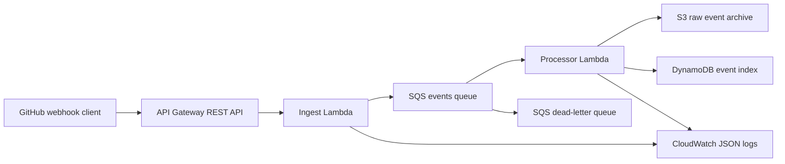

# Terraform LocalStack Event Platform

Local AWS event-ingestion platform built with Terraform and LocalStack. The stack exposes a GitHub-style webhook endpoint, buffers accepted events through SQS, processes them asynchronously, archives raw payloads in S3, indexes metadata in DynamoDB, and validates the full path in GitHub Actions.

## Architecture



The ingest Lambda accepts `POST /webhooks/github`, extracts GitHub delivery metadata, and returns `202 Accepted` after placing the event on SQS. The processor Lambda consumes the queue, writes the raw webhook payload to S3, stores a searchable metadata row in DynamoDB, and emits structured JSON logs.

## What This Demonstrates

- Terraform-managed API Gateway, Lambda, SQS, S3, DynamoDB, IAM, and CloudWatch Logs.
- Async event processing with an SQS buffer and dead-letter queue.
- LocalStack-backed Terraform remote state in S3.
- Unit-tested Lambda handler boundaries.
- GitHub Actions validation that performs real assertions against the API response, DynamoDB item, S3 object, and processor logs.

## Repository Layout

```text
app/
  ingest_handler.py       # API Gateway -> SQS Lambda
  processor_handler.py    # SQS -> S3 + DynamoDB Lambda
infra/
  backend.localstack.hcl  # LocalStack S3 backend config for Terraform state
  main.tf                 # Application infrastructure
  providers.tf            # LocalStack AWS provider endpoints
  outputs.tf              # API, storage, queue, Lambda, and log outputs
tests/
  test_handlers.py        # Python unit tests for Lambda behavior
```

## Local Run

Start LocalStack:

```powershell
docker run --rm -it `
  --name localstack `
  -p 4566:4566 `
  -p 4510-4559:4510-4559 `
  -v /var/run/docker.sock:/var/run/docker.sock `
  -e SERVICES=apigateway,dynamodb,iam,lambda,logs,s3,sqs,sts `
  -e AWS_DEFAULT_REGION=eu-central-1 `
  localstack/localstack:4.4.0
```

In another terminal:

```bash
python -m unittest discover -s tests -v
pip install awscli-local
awslocal s3 mb s3://localstack-platform-terraform-state || true
terraform -chdir=infra init -reconfigure -backend-config=backend.localstack.hcl
terraform -chdir=infra apply -auto-approve
```

Post a sample GitHub webhook:

```bash
api_url="$(terraform -chdir=infra output -raw api_gateway_invoke_url)"
delivery_id="local-$(date +%s)"

curl -i \
  -X POST "$api_url" \
  -H "Content-Type: application/json" \
  -H "X-GitHub-Event: push" \
  -H "X-GitHub-Delivery: $delivery_id" \
  --data '{
    "ref": "refs/heads/main",
    "repository": {"full_name": "AAAmer91/terraform-localstack-platform"},
    "pusher": {"name": "local-dev"}
  }'
```

Inspect the processed event:

```bash
table_name="$(terraform -chdir=infra output -raw table_name)"
bucket_name="$(terraform -chdir=infra output -raw bucket_name)"
processor_log_group="$(terraform -chdir=infra output -raw processor_log_group_name)"

awslocal dynamodb get-item \
  --table-name "$table_name" \
  --key "{\"event_id\":{\"S\":\"$delivery_id\"}}"

awslocal s3 ls "s3://$bucket_name/events/push/"
awslocal logs filter-log-events --log-group-name "$processor_log_group"
```

Clean up:

```bash
terraform -chdir=infra destroy -auto-approve
```

## CI Flow

The GitHub Actions workflow starts LocalStack, creates the Terraform state bucket, initializes Terraform with the LocalStack S3 backend, deploys the stack, posts a realistic GitHub webhook through API Gateway, and asserts that:

- API Gateway returns `202`.
- The response contains the expected delivery id, event type, repository, and queued status.
- DynamoDB contains a processed item for the same delivery id.
- S3 contains the archived raw payload at the expected key.
- CloudWatch Logs contains the structured `event_processed` log line.

The workflow destroys the Terraform-managed resources at the end of each run.
